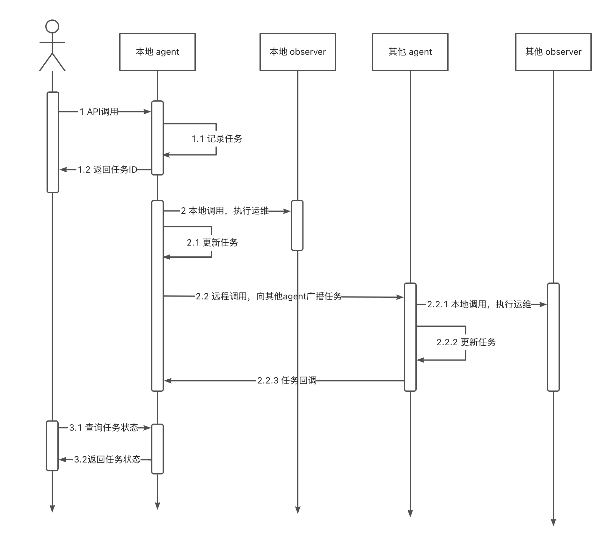

<p align="center">
    <a href="https://github.com/oceanbase/oceanbase/blob/master/LICENSE">
        
    </a>
    <a href="https://en.oceanbase.com/docs/oceanbase-database">
        
    </a>
    <a href="https://www.oceanbase.com/docs/oceanbase-database-cn">
        
    </a>
</p>

[英文版](README.md) | 中文版

**OBShell** (OceanBase Shell) 是 [OceanBase 社区](https://open.oceanbase.com/) 为运维人员 & 开发人员提供的免安装、开箱即用的本地集群命令行工具。OBShell 支持集群运维，同时基于 OBServer 对外提供运维管理 API，实现了不同生态产品对同一集群统一管理，从而方便第三方产品工具对接 OceanBase，同时降低了 OceanBase 集群管理难度和成本。

# 关键特性

- **免安装**

    OBShell 不需要额外安装。您通过任何方式安装 OceanBase-CE 数据库后都可以在任何一个节点的工作目录的 bin 目录下看到 OBShell 可执行文件。

- **运维能力**
    
    OBShell 作为开箱即用的本地集群命令行工具，支持 OceanBase 集群运维，包括集群部署、集群启动、集群停止、集群状态查询、集群节点扩容、集群升级等功能。更多功能正在开发中。

- **开放 AIP**
    
    OBShell 基于 OBServer 对外提供运维管理 API，实现了不同生态产品对同一集群统一管理，从而方便第三方产品工具对接 OceanBase，降低了 OceanBase 集群管理难度和成本。

- **应急运维**
    
    OBShell 支持集群应急运维。即使 OceanBase 集群全部宕机，也可一键拉起并自动接管（如果需要）集群。

更多信息请参考 [OBShell](https://www.oceanbase.com/quicksearch?q=obshell)。

# 快速部署 OceanBase 集群

OBShell Agent 身份转换的状态机如图所示：


可以执行下面的命令快速 [部署一个 3 副本 OceanBase 数据库实例](https://www.oceanbase.com/docs/common-oceanbase-database-cn-1000000000671670)。

## 🔥 使用 OBShell 命令行

1. 在每个节点 [启动 OBShell](https://www.oceanbase.com/docs/common-oceanbase-database-cn-1000000000671669)。

    ```shell
    # obshell 位于 oceanbase-ce 包中 /home/admin/oceanbase/bin/obshell
    # 在 xxx.xxx.xxx.1 上执行
    /home/admin/oceanbase/bin/obshell agent start --ip xxx.xxx.xxx.1
    # 在 xxx.xxx.xxx.2 上执行
    /home/admin/oceanbase/bin/obshell agent start --ip xxx.xxx.xxx.2
    # 在 xxx.xxx.xxx.3 上执行
    /home/admin/oceanbase/bin/obshell agent start --ip xxx.xxx.xxx.3
    ```

2. Single Agent 成为 Master Agent，并设置 Server 级配置

    ```shell
    # Master Agent 领导集群执行初始化任务
    /home/admin/oceanbase/bin/obshell cluster join -s "xxx.xxx.xxx.1:2886" -z zone1 -p 2881 -P 2882 -o 'memory_limit=16G,system_memory=8G,log_disk_size=24G,datafile_size=24G'
    ```

3. 其他 Single Agent 成为 Follower Agent

    ```shell
    # Follower Agent 加入 Master Agent, 跟随 Master Agent完成初始化任务
    # 在 xxx.xxx.xxx.2 上执行
    /home/admin/oceanbase/bin/obshell cluster join -s "xxx.xxx.xxx.1:2886" -z zone2 -p 2881 -P 2882 -o 'memory_limit=16G,system_memory=8G,log_disk_size=24G,datafile_size=24G'
    # 在 xxx.xxx.xxx.3 上执行
    /home/admin/oceanbase/bin/obshell cluster join -s "xxx.xxx.xxx.1:2886" -z zone3 -p 2881 -P 2882 -o 'memory_limit=16G,system_memory=8G,log_disk_size=24G,datafile_size=24G'
    ```

4. 设置集群级配置并初始化集群

    ```shell
    # 在任一节点上执行
    /home/admin/oceanbase/bin/obshell cluster init -n ob-test --rp ***
    ```

5. 连接 OceanBase 集群

    ```shell
    obclient -hxxx.xxx.xxx.1 -uroot@sys -P2881 -A -p *** 
    ```
更多信息参考 [OBShell 集群命令组](https://www.oceanbase.com/docs/common-oceanbase-database-cn-1000000000671675)。


## 👨‍💻 使用源码编译

参考 [OBShell 编译手册](COMPILE.md) 了解如何编译 OBShell。

# 系统架构


每个 OBShell Agent 管理一个 observer。整个集群的运维操作由一个 OBShell Agent 发起，多个 OBShell Agent 共同协调推进。

集群调用时序图如下：


# License

OBShell 根据 Apache 公共许可证版本 2 获得许可。有关详细信息，请参阅 [LICENSE](LICENSE) 文件。

# 社区

有以下加入社区的方法：

* [中文论坛](https://ask.oceanbase.com/)
* [Slack Workspace](https://join.slack.com/t/oceanbase/shared_invite/zt-1e25oz3ol-lJ6YNqPHaKwY_mhhioyEuw)
* [Ask on Stack Overflow](https://stackoverflow.com/questions/tagged/oceanbase)
* 钉钉群: 33254054 ([二维码](img/dingtalk.png))
* 微信群 (添加微信小助手: OBCE666)
